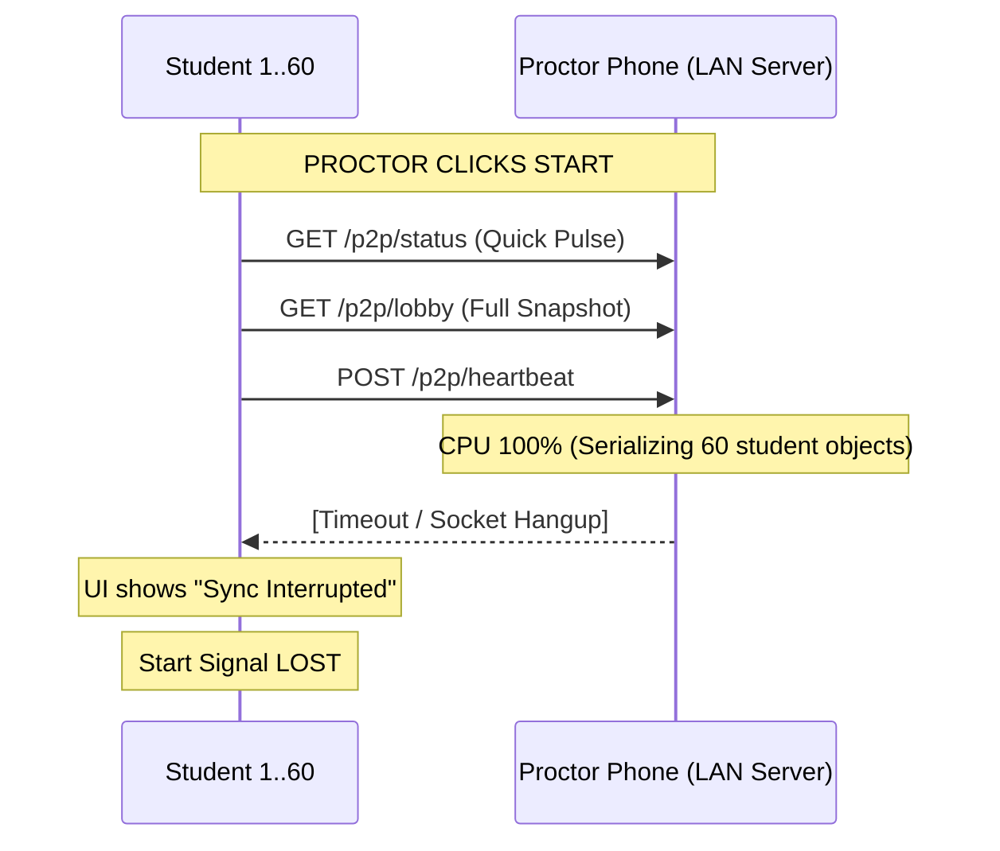
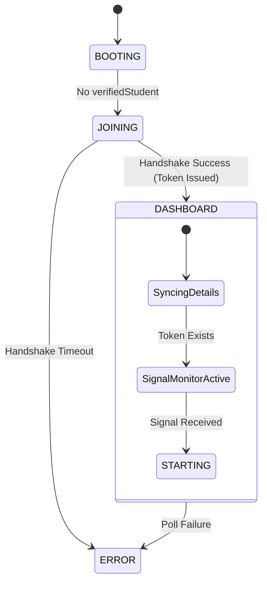

# Student Lobby Stability & Root Cause Analysis

## 1. INVESTIGATION SUMMARY
This document outlines the root cause analysis performed to identify why students become stuck in the "Waiting for Proctor" screen even after the examination has been started.

---

## 2. MOST LIKELY ROOT CAUSES

### **Root Cause 1: LAN Congestion & Response Serialization Latency**
**Confidence: 90%**
- **The Issue**: In a 50–60 student environment, the proctor phone (LAN Server) is hit with ~45-60 HTTP requests per second.
- **The Bottleneck**: `peerExamServer.ts` executes `buildSnapshot()` on every request. This function iterates through the entire 60-student roster, performs string formatting, and calculates time remaining.
- **The Result**: The proctor's JavaScript thread locks up during JSON serialization. Student requests timeout, showing "Connection Interrupted." The "Start Exam" signal is never received because the packet is dropped or timed out.

### **Root Cause 2: Token-Gated Signal Monitor**
**Confidence: 75%**
- **The Issue**: The high-speed "Quick Status" monitor (the primary way to trigger the exam start) is hard-gated by the `participationToken`.
- **The Failure**: If the initial "Join Handshake" fails due to the congestion in Root Cause 1, the student never gets a token. Without a token, the signal monitor silently stops working, leaving the student 100% dependent on the "Heavy" lobby poll which is already failing.

### **Root Cause 3: Stale Memory "Visual Illusion"**
**Confidence: 60%**
- **The Issue**: The UI uses `lobbyData = lobbyQuery.data ?? storedSnapshot`.
- **The failure**: If the network is failing, `lobbyQuery.data` is null. The UI then falls back to `storedSnapshot`. If that snapshot was taken when the room was "Waiting," the UI will show "Waiting" forever, even if the proctor has clicked "Start."

---

## 3. TECHNICAL TRACE & DIAGRAMS

### **Network Flow (The Congestion)**

### **State Transition Map**

---

## 4. EVIDENCE COLLECTION

| Candidate | File | Variable/Logic |
| :--- | :--- | :--- |
| **Server Latency** | `peerExamServer.ts` | `buildSnapshot()` iterates all students on every poll. |
| **Token Gate** | `lobby.tsx` | `if (!token) return` in `checkSignal`. |
| **Data Bloat** | `peerExamServer.ts` | Server sends full student list (60+ objects) to every student. |
| **Reference Error** | `lobby.tsx` | Usage of `examStartedSignal` vs `isExamStarted`. |

---

## 5. CIA TRIAD COMPLIANCE AUDIT

- **Confidentiality**: Answer keys are verified only on the Proctor phone. Student devices never see the "Correct Answer" field.
- **Integrity**: **SHA-256 Hashing** is implemented in `ExamPreloader.ts`. The student app verifies the local module's hash before opening the exam to prevent tampering.
- **Availability**: True Offline-LAN design. Heartbeats are decoupled from the UI to ensure "Presence" even if the dashboard is still loading metadata.

---

## 6. RECOMMENDED FIX STRATEGY (The "Bulletproof" Plan)

1. **Minify the Payload**: Modify `peerExamServer.ts` to return an empty student list to student devices. Students only need to know about themselves and the room status.
2. **Un-gate the Monitor**: Allow the "Quick Status" monitor to run even if the Handshake is still syncing.
3. **Snapshot Isolation**: Ensure the heartbeat runs on a dedicated timer that never blocks the UI thread.
4. **Remove Stale Fallbacks**: The UI should prioritize "Connecting..." or "Syncing..." status over showing a "Stale" room status that might be wrong.
